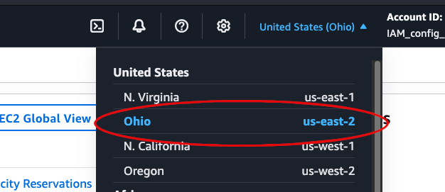
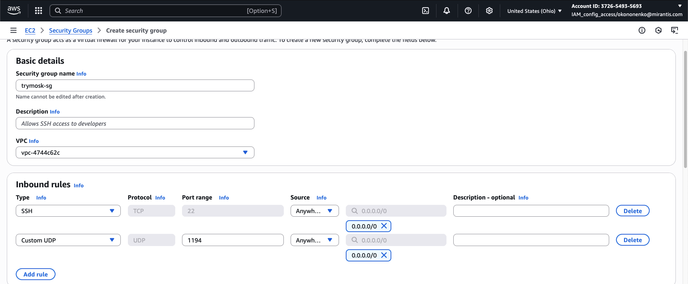
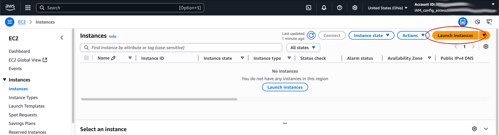
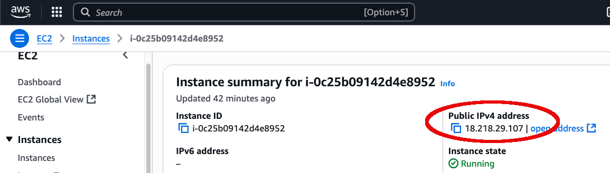

You can get a TryMOSK image from the [Mirantis CDN server](https://binary.mirantis.com/?prefix=trymos/bin/)
The latest image releases are located in folders with pefix `mosk-` in the name. You can also use a prepared
AMI image on Amazon servers. This article describes the steps required to deploy TryMOSK from a prepared AMI
image. At present time they are available on the `us-east-2` region.

## Creating a TryMOSK Instance Using the Amazon EC2 Console

**Step 1: Open the Amazon EC2 Console**

1. Sign in to the AWS Management Console.
2. Open the Amazon EC2 console at: [https://console.aws.amazon.com/ec2/](https://console.aws.amazon.com/ec2/).

**Step 2: Select the AWS Region**

1. In the navigation bar at the top-right, locate the **Region selector**.
2. Select **US East (Ohio)**.
   

**Step 3: Create a Security Group**

1. In the left navigation pane, under **Network & Security**, choose **Security Groups**.
2. Click **Create security group**.
3. In the **Basic details** section, provide:
   * **Security group name**: A descriptive name (for example: `trymosk-sg`).
   * **Description**: Purpose of the security group.
4. In the **Inbound rules** section:
   * Click **Add rule**.
   * For **Type**, choose **SSH**.
   * If you plan to use OpenVPN, click **Add rule** again, choose **Custom UDP Rule**, set **Port range** to `1194`, and **Protocol** to UDP.
5. Click **Create security group**.
   

**Step 4: Launch the TryMOSK instance**

1. In the left navigation pane, choose **Instances**, then click **Launch instances**.
2. Under **Name and tags**, set the **Name** (for example: `My TryMOSK`).
3. Under **Application and OS Images (Amazon Machine Image)**:
   * Type `trymosk` in the search box.
   * Select the required image from the results.
4. Under **Instance type**, choose **t2.xlarge** (or **t2.2xlarge** for better performance).
5. Under **Key pair (login)**:
   * Select an existing key pair, or
   * Click **Create new key pair** to create one.
6. Under **Network settings**, choose **Select existing security group** and select the one created in Step 3\.
7. Under **Configure storage**, set **Root volume size** to **40 GB or more**.
8. Click **Launch instance**.
   

**Step 5: Get the instance’s Public IP address**

1. Wait until the **Instance state** changes to **Running**.
2. Select your instance and note the **Public IPv4 address** in the details panel.
   

**Step 6: Connect to the instance via SSH**

* **Linux/macOS**:

```shell
ssh -i /path/to/private-key.pem ubuntu@<PublicIPv4Address>
```

* **Windows (PuTTY)**:
1. Convert your `.pem` key to `.ppk` using PuTTYgen.
2. Open PuTTY, enter the public IPv4 address, and load your `.ppk` key in **Connection → SSH → Auth**.

## Creating a TryMOSK Instance Using the AWS CLI

This procedure describes how to launch a TryMOSK EC2 instance using the AWS Command Line Interface (AWS CLI).

**Step 1: Install the AWS CLI**

Follow the installation instructions in the AWS CLI User Guide:
 [https://docs.aws.amazon.com/cli/latest/userguide/getting-started-install.html](https://docs.aws.amazon.com/cli/latest/userguide/getting-started-install.html)

**Step 2: Configure the AWS CLI**

1. Follow the quick start configuration guide:
    [https://docs.aws.amazon.com/cli/latest/userguide/getting-started-quickstart.html](https://docs.aws.amazon.com/cli/latest/userguide/getting-started-quickstart.html)
2. **Important**: Set the default AWS region to us-east-2 to ensure all operations are performed in the correct region:

```shell
aws configure set region us-east-2
```

**Step 3: Create or import a Key Pair**

You will use this key pair to connect to your EC2 instance via SSH.

**Option A – Create a new key pair**

```shell
aws ec2 create-key-pair --key-type rsa --key-name <your-key-name> \
--query 'KeyMaterial' --output text > <private-key-file>.pem
```

Where:

* `<your-key-name>` – unique key pair name (up to 255 ASCII characters).
* `<private-key-file>` – file name for the private RSA key (keep it in a safe place).

**Example:**

```shell
aws ec2 create-key-pair --key-type rsa --key-name my-key-for-trymosk \
--query 'KeyMaterial' --output text > my_private_key.pem
```

**Option B – Import an existing public key**

```shell
aws ec2 import-key-pair --key-name <your-key-name> \
--public-key-material fileb://<public-key-file>
```

Where:

* `<public-key-file>` – path to the `.pub` public key file.

**Example:**

```shell
aws ec2 import-key-pair --key-name another-key-for-trymosk \
--public-key-material fileb://home/ubuntu/test_rsa.pub --output text
```

Example response:

```
b8:d6:be:72:9c:60:d8:b8:59:d9:00:ab:bd:9d:8c:f8 another-key-for-trymosk key-00d4cf79ad02dd1c5
```

**Step 4: Create a Security Group**

**4.1. Find your default VPC ID**
```shell
aws ec2 describe-vpcs --query='Vpcs[?IsDefault].VpcId' --output text
```
Example of response:
```
  vpc-4744c62c
```

**4.2. Create the security group**
```shell
aws ec2 create-security-group --group-name <your sg name> \
--description "<your sg description>" --vpc-id <VPC Id> \
--query='GroupId' --output text
```
Where:

* `<sg-name>` – security group name (unique within VPC, up to 255 characters, cannot start with `sg-`).
* `<sg-description>` – description of the security group.
* `<VPC-ID>` – ID from step 4.1

**Example:**
```shell
aws ec2 create-security-group --group-name trymosk-security-group \
--description "Test security group for TryMOSK" --vpc-id vpc-4744c62c \
--query='GroupId' --output text
```
Example of response:
```
sg-0d72aa991587b5648
```

**4.3. Add inbound rules**
Allow SSH (port 22\) and OpenVPN (port 1194 UDP):
```shell
aws ec2 authorize-security-group-ingress --group-id <sg-id> --protocol tcp --port 22 --cidr 0.0.0.0/0
aws ec2 authorize-security-group-ingress --group-id <sg-id> --protocol udp --port 1194 --cidr 0.0.0.0/0
```
Where `<sg-id>` is from step 4.2.

**Step 5: Find the TryMOSK AMI ID**

```
aws ec2 describe-images --filters Name=name,Values="trymosk*" \
--query='Images[*].[ImageId,Name,CreationDate]' --output table
```

 Example response:

```
--------------------------------------------------------------------------------------------------
|                                         DescribeImages                                         |
+-----------------------+-------------------------------------------+----------------------------+
|  ami-0504712c3ecb27331|  trymosk-jammy-amd64-25.1-20250723112122  |  2025-07-29T09:52:53.000Z  |
+-----------------------+-------------------------------------------+----------------------------+
```

**Step 6: Launch the TryMOSK instance**

```shell
aws ec2 run-instances --image-id <AMI Id> --count 1 \
--instance-type t2.xlarge \
--key-name <rsa key pair name> \
--security-group-ids <sg id> \
--associate-public-ip-address \
--block-device-mapping DeviceName=/dev/sda1,Ebs={VolumeSize=<root volume size>} \
--query='Instances[0].InstanceId' --output text
```

Where:

* `<AMI-ID>` – AMI ID from step 5\.
* `<rsa-key-name>` – key pair from step 3\.
* `<sg-id>` – security group from step 4\.
* `<root-size>` – root volume size (minimum 40 GB).

**Example:**

```shell
aws ec2 run-instances --image-id ami-0504712c3ecb27331 --count 1 \
--instance-type t2.xlarge \
--key-name another-key-for-trymosk \
--security-group-ids sg-0d72aa991587b5648 \
--associate-public-ip-address \
--block-device-mapping DeviceName=/dev/sda1,Ebs={VolumeSize=40} \
--query='Instances[0].InstanceId' --output text
```

Example of response:

```
i-0c8a0969dfd64c909
```

**Step 7: Wait for the instance to start**

```shell
aws ec2 describe-instances --instance-ids <your instance Id> \
--query='Reservations[0].Instances[0].State.Name' --output text
```

Where  `<your instance Id>` is from step 6\.
**Example:**

```shell
aws ec2 describe-instances --instance-ids i-0c8a0969dfd64c909 \
--query='Reservations[0].Instances[0].State.Name' --output text
```

Example of response:

```
pending
```

**Step 8: Get the public IPv4 address**

```shell
aws ec2 describe-instances --instance-ids <your instance Id> \
--query='Reservations[0].Instances[0].PublicIpAddress' --output text
```

Where `<your instance Id>` is from step 6\.
**Example:**

```shell
aws ec2 describe-instances --instance-ids i-0c8a0969dfd64c909 \
--query='Reservations[0].Instances[0].PublicIpAddress' --output text
```

Example of response:

```
18.218.29.107
```

**Step 9: Connect via SSH**

From your local computer:

* **Linux/macOS**:

```shell
ssh -i /path/to/private-key.pem ubuntu@<PublicIPv4Address>
```

* **Windows (PuTTY)**:
    + Convert your `.pem` key to `.ppk` using PuTTYgen.
    + Open PuTTY, enter the public IPv4 address, and load your `.ppk` key in **Connection → SSH → Auth**.

## Setting up TryMOSK on an AWS instance

This section explains how to set up TryMOSK on the EC2 instance created in the previous steps.

**Step 1: Start the TryMOSK installation**

The installation process takes approximately **25 minutes**. It will:

* Install and configure **Kubernetes** and **Rockoon** on the instance.
* Set up the **OpenVPN server**.
* Create the OpenVPN client configuration file.

Run the following command to start the setup:

```shell
sudo screen -d -m /srv/trymosk/launch.sh
```

This runs the installation script inside a **screen** session, allowing it to continue even if your SSH connection is interrupted.

**Step 2: Monitor the installation**

You can view the installation log in real time:

```shell
sudo tail -f /var/log/trymosk-install.log
```

**Step 3: Access TryMOSK after installation**

When installation is complete, you can:

1. Work with MOS directly via the console, **or**
2. Retrieve the OpenVPN client configuration file and set up a VPN connection from your local computer.

Once connected via VPN, you can use:

* **Horizon** (OpenStack web interface)
* **Mirantis Lens**
* Local `kubectl` commands to manage TryMOSK services.

**Step 4: View system information and credentials**

After installation, system details, OpenStack version, and admin credentials will be displayed as a *Message of the Day (MOTD)* upon SSH login.

Example output:

```shell
OS_FAMILY: Debian
OS_DISTRO: Ubuntu
OS_DISTRO_VERSION: 22.04
OPENSTACK_VERSION: caracal
ROCKOON_VERSION: 1.0.11
ADMIN_USERNAME: adminlpsdb63Gvn1
ADMIN_PASSWORD: tLuQfuJVAxxxxxxxxxxxxx
```
